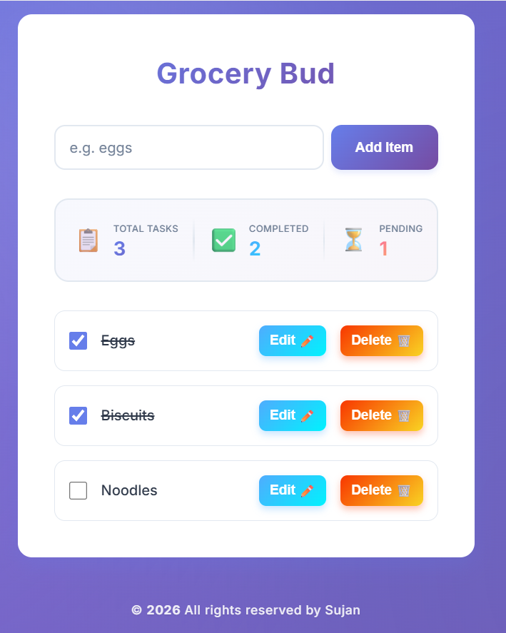

# Grocery Bud

A modern, responsive grocery list application built with vanilla JavaScript. This application allows users to effectively manage their grocery items with a clean user interface and robust functionality.



## Features

-   **CRUD Operations**: Easily Add, Edit, and Delete grocery items.
-   **Task Tracking**: Mark items as completed or pending to keep track of your shopping progress.
-   **Smart Notifications**: visual feedback for all actions (Item Added, Item Updated, Item Deleted) that auto-hide for a seamless experience.
-   **Live Statistics**: A dynamic counter displaying:
    -   Total Tasks
    -   Completed Tasks
    -   Pending Tasks
-   **Local Storage**: Data is persisted in the browser's Local Storage, ensuring your list is saved even after refreshing the page or closing the browser.
-   **Responsive Design**: Fully responsive layout that works beautifully on mobile, tablet, and desktop devices.

## Technologies Used

-   **HTML5**: Semantic markup for structure.
-   **CSS3**: Custom styling with CSS Variables, Flexbox, and Grid for layout and aesthetics.
-   **JavaScript (ES6+)**: Modular JavaScript architecture using `import`/`export` for clean and maintainable code.
-   **Font Awesome**: For intuitive icons.

## Project Structure

```
Grocery bud/
├── index.html        # Main entry point
├── css/              # Stylesheets
│   ├── global.css
│   ├── items.css
│   ├── form.css
│   ├── counter.css
│   ├── notification.css
│   └── single-item.css
└── js/               # JavaScript Modules
    ├── app.js        # Main application logic
    ├── counter.js    # Statistics component
    ├── form.js       # Input form handling
    ├── items.js      # List rendering logic
    └── notification.js # Notification system
```

## How to Run

1.  **Clone the repository** (or download the files).
2.  **Open the project**:
    Since this project uses JavaScript ES6 Modules (`type="module"`), you cannot simply open `index.html` directly from the file system (some browsers block CORS requests for local files).
    
    **Recommended**: Use a local development server.
    *   **VS Code Live Server**: Right-click `index.html` and select "Open with Live Server".
    *   **Python**: Run `python -m http.server` in the project directory and open `localhost:8000`.
    *   **Node.js**: Use `http-server` or any similar package.

## Author

**Sujan** - *All rights reserved*
